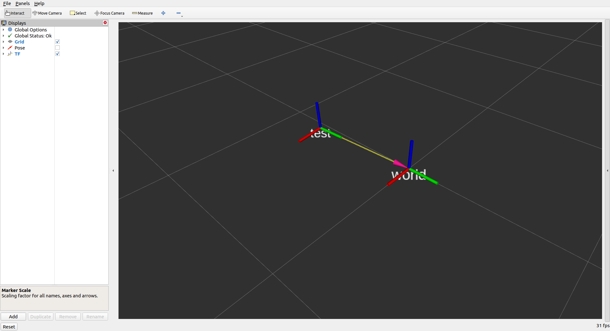

# motive_ros_foxy_sandbox

## Installation
1. [Install vrpn](https://github.com/vrpn/vrpn/wiki/Installing-and-testing)

2. Install dependent ros2/python packages
    ```sh
    cd ~/ros2_ws/src/motive_ros_foxy_sandbox
    python3 -m pip install -I -r requirements.txt
    cd ..
    vcs import < motive_ros_foxy_sandbox/.repos
    ```

3. build
    ```sh
    cd ~/ros2_ws
    colcon build --symlink-install
    ```

## Usage
1. Select markers to create a rigid body in motive as `test`
2. launch
    ```sh
    ros2 launch motive_ros_foxy_sandbox sample.launch.py
    ```

### rviz


### rqt_graph
