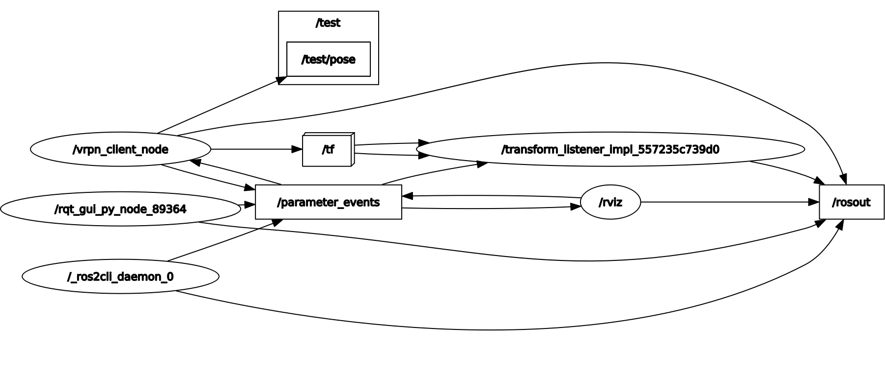

# motive_ros2_sandbox
Test package for using vrpn_client_ros with ros2(foxy)

## Installation
1. [Install vrpn](https://github.com/vrpn/vrpn/wiki/Installing-and-testing)

2. Install dependent python package
    ```sh
    cd ~/ros2_ws/src/motive_ros2_sandbox
    python3 -m pip install -I -r requirements.txt
    ```

3. Install dependent ros2 package
    ```sh
    cd ..
    vcs import < motive_ros2_sandbox/.repos
    ```

## Usage
1. Select markers to create a rigid body in motive as `test`
2. launch
    ```sh
    ros2 launch motive_ros2_sandbox sample.launch.py
    ```

### rviz


### rqt_graph


## References
- https://github.com/ros-drivers/vrpn_client_ros/issues/15
- https://github.com/ros-drivers/vrpn_client_ros/pull/16
- https://github.com/ros-drivers/vrpn_client_ros/pull/20
- https://github.com/toshi67026/vrpn_client_ros/tree/foxy_test